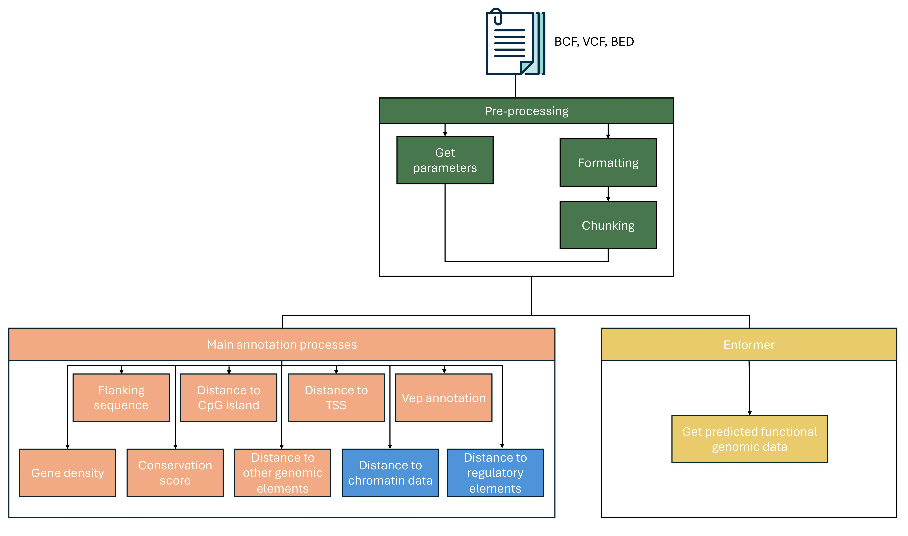

# nf-VarAnno
A cross-species variant annotation pipeline built with Nextflow. The pipeline offers five categories of annotations: sequence conservation, variant position properties, VEP annotations, sequence context, and predicted functional genomic scores using the Enformer deep learning sequence-based model. Below is the structure of the pipeline:

# Requirements
The workflow is developed using Nextflow with an Anaconda environment. To run this pipeline, you need to install:
1. [Anaconda](https://www.anaconda.com/products/individual)
2. [Nextflow](https://www.nextflow.io/)
3. [Java 11 (or later, up to 22)](http://www.oracle.com/technetwork/java/javase/downloads/index.html)

