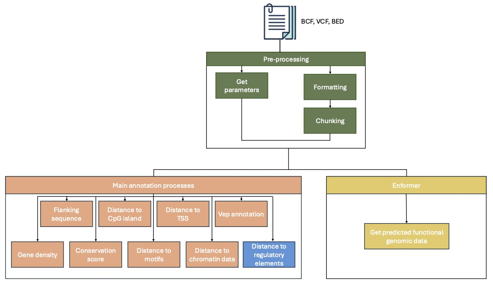

# nf-VarAnno
A cross-species variant annotation pipeline built with Nextflow. The pipeline offers five categories of annotations: sequence conservation, variant position properties, VEP annotations, sequence context, and predicted functional genomic scores using the Enformer deep learning sequence-based model. Below is the structure of the pipeline:



# Requirements
The workflow is developed using Nextflow with an Anaconda environment. To run this pipeline, you need to install:
1. [Anaconda](https://www.anaconda.com/products/individual)
2. [Nextflow](https://www.nextflow.io/)
3. [Java 11 (or later, up to 22)](http://www.oracle.com/technetwork/java/javase/downloads/index.html)

# Input
To run the annotation pipeline, you'll need:
1. The input target variant file should be in BED, VCF, or BCF format. It is recommended to use the BED format (0-based) as the input, which includes four columns: chrom, start, end, and variant_id. Below is an example of an input file. he variant_id should follow the pattern chrom_end_ref_alt, where end corresponds to the position of the variant, and ref and alt correspond to the reference and alternative alleles of the variant, respectively.
```bash
# Example of a BED file
chr1  12184213  12184214  chr1_12184214_C_T
chr17  15164948  15164949  chr17_15164949_C_T

